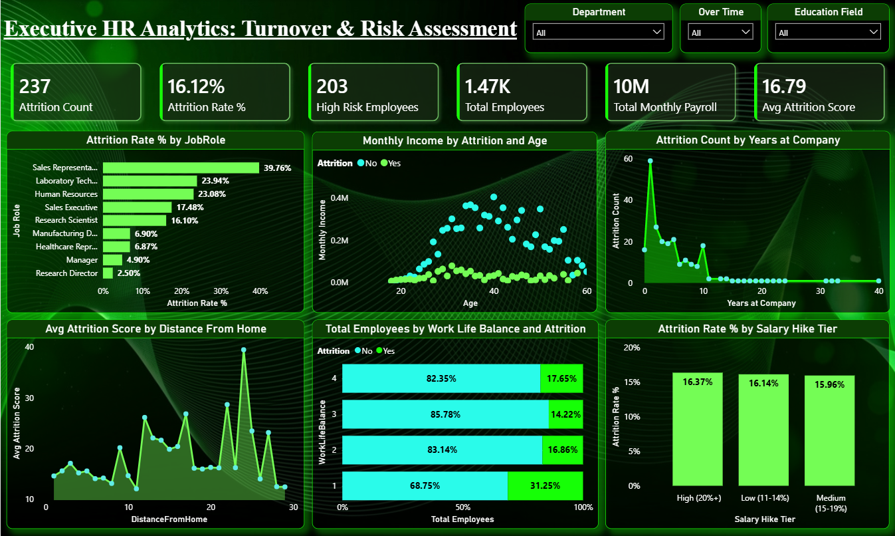
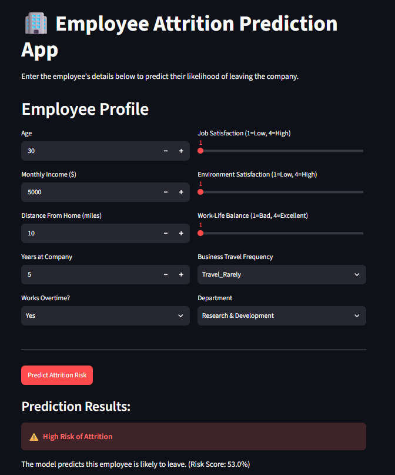

<h1 align="center">🏢 HR Analytics: Employee Attrition Prediction & Dashboard</h1>

<p align="center">
  An end-to-end HR analytics solution combining <b>Machine Learning</b>, an interactive <b>Streamlit app</b>, and a full <b>Power BI executive dashboard</b> to predict and visualize employee attrition risk.
</p>

<p align="center">
  
  
  
  
  
</p>

---

## 📖 Table of Contents

- [📌 Overview](#-overview)
- [✨ Key Features](#-key-features)
- [📊 Power BI Dashboard](#-power-bi-dashboard)
- [🤖 Streamlit Prediction App](#-streamlit-prediction-app)
- [🧠 Model Details](#-model-details)
- [🗂️ Project Structure](#️-project-structure)
- [🛠️ Tech Stack](#️-tech-stack)
- [🚀 Getting Started](#-getting-started)
- [📈 Dataset](#-dataset)
- [🔮 Future Improvements](#-future-improvements)
- [📄 License](#-license)

---

## 📌 Overview

Employee attrition is one of the costliest problems HR teams face — replacing an employee can cost **6–9 months of their salary**. This project tackles the problem from two angles:

1. **Diagnostic** — a Power BI dashboard that helps HR leaders understand *why* employees leave, broken down by job role, income, tenure, work-life balance, and more.
2. **Predictive** — a Random Forest classification model, deployed as a Streamlit web app, that predicts the *individual* attrition risk of an employee based on their profile.

Together, they give HR teams both the big-picture trends and a tool to flag at-risk employees before they walk out the door.

---

## ✨ Key Features

- 🔍 **Exploratory Data Analysis** on the IBM HR Analytics dataset (1,470 employees, 35 features)
- 🧹 **Data Cleaning & Preprocessing** — null checks, duplicate checks, dropping redundant constant columns
- 🏗️ **Feature Engineering** — label encoding for the target variable and one-hot encoding for categorical features
- 🌲 **Random Forest Classifier** trained to predict attrition (Yes/No)
- 📊 **Attrition Risk Scores** generated for every employee and exported for Power BI
- 📈 **Interactive Power BI Dashboard** with slicers for Department, Overtime, and Education Field
- 🌐 **Streamlit Web App** for real-time, single-employee attrition risk prediction
- 🎨 Clean, dark-themed UI for both the dashboard and the app

---

## 📊 Power BI Dashboard

The **Executive HR Analytics: Turnover & Risk Assessment** dashboard gives a 360° view of attrition across the organization.

<p align="center">
  
</p>

**Highlights visualized:**

| Metric | Insight |
|---|---|
| 📉 Attrition Rate % | Overall and by Job Role |
| 💰 Monthly Income vs Age | Attrition patterns across income & age bands |
| 📆 Years at Company | Tenure vs attrition count |
| 🏠 Distance From Home | Attrition score vs commute distance |
| ⚖️ Work-Life Balance | Attrition split by balance rating |
| 💵 Salary Hike Tier | Attrition rate by salary hike bracket |

The dashboard is filterable by **Department**, **Over Time**, and **Education Field**, allowing HR stakeholders to drill into specific segments of the workforce.

📁 File: [`HR_Analytics_Attrition_Dashboard.pbix`](./HR_Analytics_Attrition_Dashboard.pbix)
📁 Data source: [`HR_Analytics_for_PowerBI.csv`](./HR_Analytics_for_PowerBI.csv) (original dataset + model-generated risk scores)

---

## 🤖 Streamlit Prediction App

A lightweight web app that lets anyone enter an employee's profile and instantly get an attrition risk prediction.

<p align="center">
  
</p>

**How it works:**
1. Enter employee details — age, income, distance from home, tenure, overtime, job/environment satisfaction, work-life balance, business travel, and department.
2. The app one-hot encodes the inputs and aligns them to the exact feature set the model was trained on.
3. Click **Predict Attrition Risk** to get a ✅ Low Risk or ⚠️ High Risk verdict, along with a risk score (%).

📁 File: [`app.py`](./app.py)

---

## 🧠 Model Details

- **Algorithm:** Random Forest Classifier (`n_estimators=100`, `random_state=42`)
- **Target:** `Attrition` (Yes = 1, No = 0)
- **Split:** 80% train / 20% test
- **Preprocessing:** Dropped non-informative constant columns (`EmployeeCount`, `StandardHours`, `Over18`, `EmployeeNumber`), one-hot encoded remaining categorical features

**Test set performance:**

| Class | Precision | Recall | F1-score | Support |
|---|---|---|---|---|
| No Attrition (0) | 0.88 | 1.00 | 0.93 | 255 |
| Attrition (1) | 0.80 | 0.10 | 0.18 | 39 |
| **Accuracy** | | | **0.88** | 294 |

> ⚠️ **Note:** The dataset is imbalanced (only ~16% of employees left), so while overall accuracy is high, recall on the minority "Attrition" class is low. This is a good candidate for future improvement — see [Future Improvements](#-future-improvements).

The trained model is saved as [`rf_attrition_model.pkl`](./rf_attrition_model.pkl) and loaded directly by the Streamlit app.

---

## 🗂️ Project Structure

```
HR-Analytics-Employee-Attrition-Prediction-Dashboard/
│
├── 📓 HR_Analytics_Project_Preprocessing_.ipynb   # EDA, preprocessing & model training notebook
├── 📄 WA_Fn-UseC_-HR-Employee-Attrition.csv        # Raw IBM HR Analytics dataset
├── 📄 HR_Analytics_for_PowerBI.csv                 # Dataset enriched with attrition risk scores
├── 🌲 rf_attrition_model.pkl                       # Trained Random Forest model
├── 📊 HR_Analytics_Attrition_Dashboard.pbix        # Power BI dashboard file
├── 🖥️ app.py                                       # Streamlit prediction app
├── 📦 requirements.txt                             # Python dependencies
└── 🖼️ screenshots/                                 # Images used in this README
    ├── Background_image.png
    ├── Dashboard_image.png
    └── app_image.png
```

---

## 🛠️ Tech Stack

| Category | Tools |
|---|---|
| **Language** | Python 🐍 |
| **Data Analysis** | Pandas, NumPy |
| **Visualization (EDA)** | Matplotlib, Seaborn |
| **Machine Learning** | scikit-learn (Random Forest) |
| **Web App** | Streamlit |
| **BI / Dashboarding** | Power BI |
| **Model Persistence** | Pickle |

---

## 🚀 Getting Started

### 1️⃣ Clone the repository
```bash
git clone https://github.com/mayanksingh2108/HR-Analytics-Employee-Attrition-Prediction-Dashboard.git
cd HR-Analytics-Employee-Attrition-Prediction-Dashboard
```

### 2️⃣ Install dependencies
```bash
pip install -r requirements.txt
```

### 3️⃣ Run the Streamlit app
```bash
streamlit run app.py
```
Then open the local URL Streamlit prints in your terminal (usually `http://localhost:8501`).

### 4️⃣ Explore the Power BI dashboard
Open `HR_Analytics_Attrition_Dashboard.pbix` in [Power BI Desktop](https://powerbi.microsoft.com/desktop/) to interact with the full dashboard.

### 5️⃣ (Optional) Re-run the analysis / retrain the model
Open `HR_Analytics_Project_Preprocessing_.ipynb` in Jupyter to walk through the EDA, preprocessing, and model training steps yourself.

---

## 📈 Dataset

This project uses the popular **IBM HR Analytics Employee Attrition & Performance** dataset:

- 👥 **1,470** employee records
- 📊 **35** features covering demographics, compensation, job role, satisfaction scores, and work history
- 🎯 **Target variable:** `Attrition` (Yes/No)

---

## 🔮 Future Improvements

- ⚖️ Address class imbalance (e.g., SMOTE, class weighting) to improve recall on the attrition-positive class
- 🧪 Experiment with other models (XGBoost, Logistic Regression) and compare via ROC-AUC
- 🔧 Hyperparameter tuning (GridSearchCV / RandomizedSearchCV)
- 📊 Add SHAP/feature-importance explainability to the Streamlit app
- ☁️ Deploy the Streamlit app to Streamlit Community Cloud for public access
- 🔁 Automate the Power BI data refresh pipeline

---

## 📄 License

This project is licensed under the [MIT License](LICENSE) — feel free to use, modify, and share.

---

<p align="center">
  Made with ❤️ and 🌲 Random Forests by <a href="https://github.com/mayanksingh2108">Mayank Singh</a>
</p>
